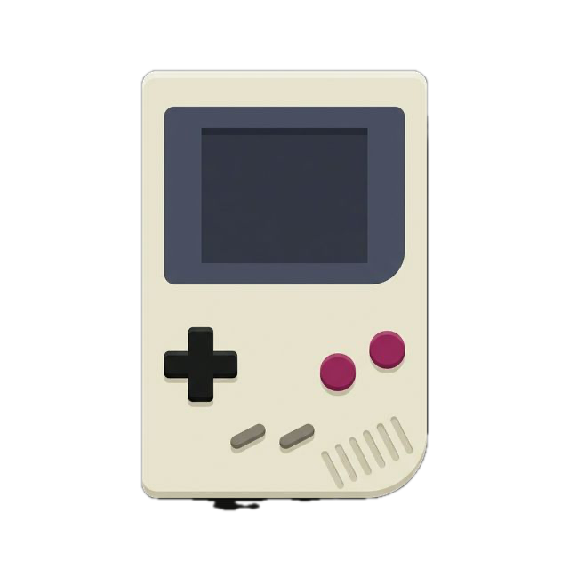
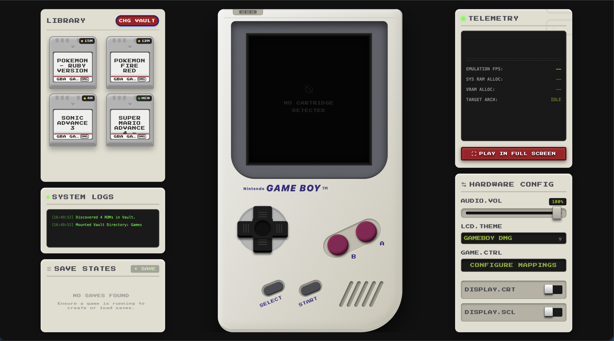
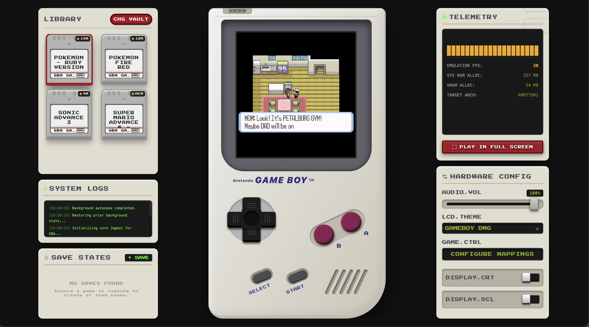
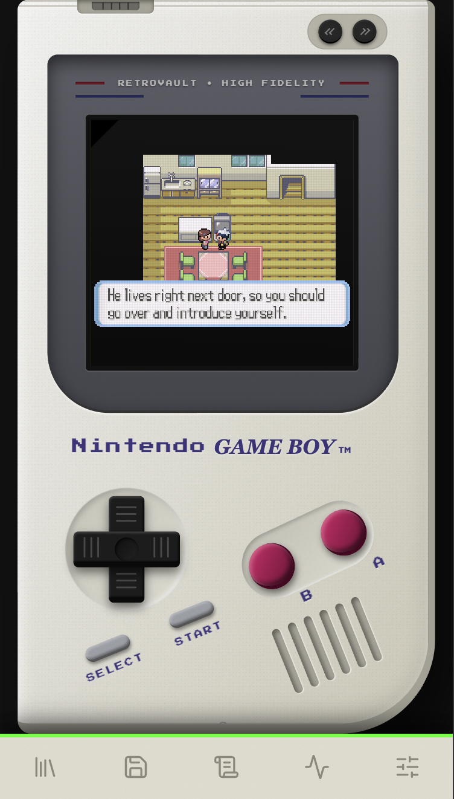
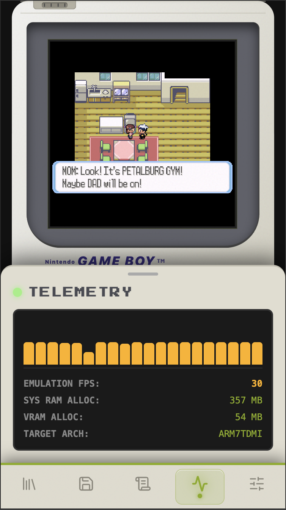

<div align="center">



<h1>RetroVault v1.1</h1>
<p><strong>A local-first, browser-based retro game emulator with a pixel-perfect skeuomorphic Game Boy shell.</strong><br/>
No uploads. No servers. No accounts. Just your ROMs, running right in the browser.</p>

[](https://react.dev)
[](https://nostalgist.js.org)
[](https://turbo.build)
[](https://www.typescriptlang.org)
[](LICENSE)

</div>

---

## 📸 Screenshots

### Desktop — Game Library & Dashboard


### Desktop — Actively Playing Pokémon Ruby


### Mobile — Full-Screen Gameplay & Telemetry

<div align="center">
<table>
  <tr>
    <td align="center" width="45%">
      
      <br/><em>Full-screen gameplay on mobile</em>
    </td>
    <td align="center" width="45%">
      
      <br/><em>Telemetry bottom-sheet</em>
    </td>
  </tr>
</table>
</div>

---

## ✨ Features

| Feature | Details |
|---|---|
| 🕹️ **Skeuomorphic Game Boy Shell** | Full 3D-rendered plastic Game Boy shell with D-pad, A, B, Select, Start and a speaker grill |
| 📦 **Zero-Upload ROM Library** | Uses the File System Access API — ROMs never leave your device |
| 🎯 **Multi-Platform Emulation** | GBA (mGBA), SNES (Snes9x), NES (FCEUmm), GB/GBC (Gambatte) via Libretro cores |
| 💾 **Save States** | Manual save/load + 30-second background auto-saves |
| 📊 **Live Telemetry** | Real-time FPS graph, RAM/VRAM allocation, and target CPU architecture details |
| 📜 **System Logs** | Real-time console for emulator events, ROM booting, and system status |
| 🎨 **LCD Themes** | Arcade Neon, Gameboy DMG, Virtual Boy — switch on the fly |
| 📱 **Mobile Ready** | Full responsive layout with a themed bottom-sheet navigation |
| ⌨️ **Rebindable Controls** | Map any key to A, B, Up, Down, Left, Right, Start, Select |
| 🖥️ **CRT & Scanlines** | Toggle retro display filters for that authentic 90s feel |
| 🔒 **Privacy First** | 100% client-side — no analytics, no cloud, no tracking |

---

## 🚀 Getting Started

### Prerequisites

| Tool | Version |
|---|---|
| Node.js | ≥ 18.x |
| pnpm | ≥ 8.x |
| A modern browser | Chrome 86+ / Edge 86+ / Safari 15.2+ |

> **Note:** Firefox does not support the File System Access API (`showDirectoryPicker`). Chrome or Edge is recommended.

### 1. Clone the Repository

```bash
git clone https://github.com/RishabhRai280/RetroVault.git
cd RetroVault
```

### 2. Install Dependencies

```bash
pnpm install
```

This installs all packages in the monorepo — the `web` app, `@retrovault/core`, `@retrovault/db`, and `@retrovault/ui`.

### 3. Prepare Your ROMs

Create a folder anywhere on your computer (e.g. `~/Games`) and drop your ROM files in:

```
~/Games/
├── Pokemon Fire Red.gba
├── Pokemon Ruby.gba
├── Sonic Advance 3.gba
├── Super Mario Advance 4.gba
├── Super Mario World.smc
└── Super Mario Bros.nes
```

> **Supported formats:** `.gba` · `.smc` · `.sfc` · `.nes` · `.gb` · `.gbc`

### 4. Start the Dev Server

```bash
pnpm run dev
```

This starts the full Turborepo pipeline. The web app will be at:

```
http://localhost:5173
```

### 5. Load Your Vault

1. Open **http://localhost:5173** in Chrome or Edge
2. Click **+ ADD ROM** in the Library panel
3. Select your Games folder in the browser's file picker — grant read access
4. Your games appear as cartridge cards. Click one to boot it instantly ⚡

---

## 🎮 Controls

### Keyboard (Desktop)

| Game Action | Default Key |
|---|---|
| D-Pad Up | `Arrow Up` |
| D-Pad Down | `Arrow Down` |
| D-Pad Left | `Arrow Left` |
| D-Pad Right | `Arrow Right` |
| A Button | `X` |
| B Button | `Z` |
| Start | `Enter` |
| Select | `Shift` |
| Rewind | `Backspace` |
| Fast Forward | `Space` |
| Full Screen | `F` |

> All keys can be rebound via **Hardware Config → Configure Mappings**.

### On-Screen Buttons (Mobile)

The Game Boy shell has a fully functional touch D-pad, A, B, Select, and Start — no keyboard needed.

---

## 🏗️ Project Structure

```
RetroVault/
├── apps/
│   └── web/                   # The React web application
│       ├── src/
│       │   ├── App.tsx        # Root layout, state, and orchestration
│       │   └── components/
│       │       ├── GameBoy/
│       │       │   └── GameBoyShell.tsx     # The skeuomorphic hardware container
│       │       ├── Library/
│       │       │   └── GameLibrary.tsx      # ROM collection management
│       │       ├── Logs/
│       │       │   └── SystemLogs.tsx       # Real-time event console
│       │       ├── Telemetry/
│       │       │   └── TelemetryDashboard.tsx # Performance metrics
│       │       └── Saves/
│       │           └── SaveStatesPanel.tsx  # State management UI
│       └── public/            # Static assets and screenshots
│
├── packages/
│   ├── core/                  # ROM scanning + metadata extraction
│   │   └── src/files.ts
│   ├── db/                    # localforage storage layer
│   │   └── src/index.ts
│   └── ui/                    # Shared UI components (Button, Card)
│
└── docs/
    ├── Architecture.md
    ├── Database_Architecture.md
    └── Development_Guide.md
```

---

## 📡 Platform Support

| Browser | ROM Load | Gameplay | Save States | Mobile |
|---|---|---|---|---|
| Chrome 86+ | ✅ | ✅ | ✅ | ✅ |
| Edge 86+ | ✅ | ✅ | ✅ | ✅ |
| Safari 15.2+ | ✅ | ✅ | ✅ | ✅ |
| Firefox | ❌ | ✅ | ✅ | ⚠️ |

> Firefox lacks `showDirectoryPicker` so ROM loading via the File System Access API is unavailable. Games can still be played if the directory handle is obtained another way.

---

## 🔧 Tech Stack

| Layer | Technology |
|---|---|
| UI Framework | React 18 + TypeScript |
| Emulation Engine | [Nostalgist.js](https://nostalgist.js.org) (Libretro WASM) |
| Styling | Tailwind CSS v3 |
| Storage | [localforage](https://localforage.github.io/localForage/) (IndexedDB) |
| ROM Access | File System Access API |
| Icons | Lucide React |
| Monorepo | Turborepo + pnpm workspaces |
| Build Tool | Vite |

---

## 📖 Documentation

| Document | Description |
|---|---|
| [Architecture.md](docs/Architecture.md) | System architecture, data flow, and design decisions |
| [Database Architecture](docs/Database_Architecture.md) | localforage storage model, data schemas, auto-save lifecycle |
| [Development Guide](docs/Development_Guide.md) | Boot flow walkthrough, how to add new cores, common issues |

---

## 🤝 Contributing

1. Fork the repo
2. Create a feature branch: `git checkout -b feat/my-feature`
3. Make your changes and commit: `git commit -m "feat: add something cool"`
4. Push to your fork: `git push origin feat/my-feature`
5. Open a pull request

---

<div align="center">

Made with ❤️ by **Rishabh Rai**

*All trademarks (Nintendo, Game Boy) are the property of their respective owners.*
*RetroVault does not distribute or endorse ROM files.*

</div>
