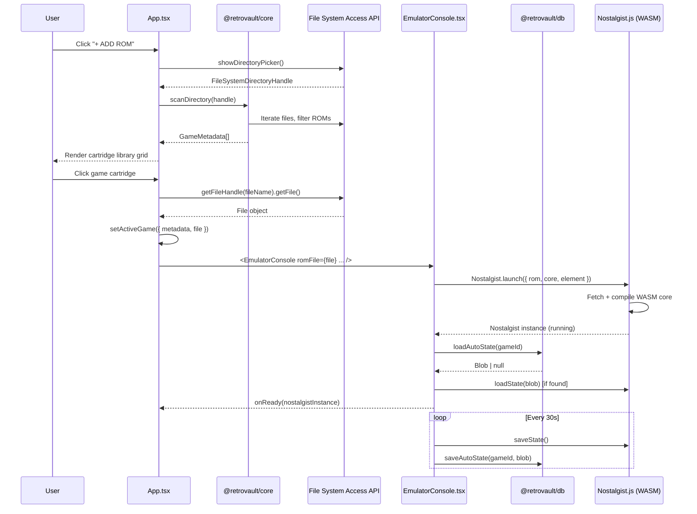

# System Architecture
## RetroVault — v1.0.0

**Status:** Implemented & Active

> This document describes the architecture **as actually built**, reflecting both the original design intent and the implementation decisions made during development.

---

## 1. High-Level Overview

RetroVault is a **local-first, single-page web application** that embeds full retro game emulation inside a highly detailed, skeuomorphic Game Boy console UI. It uses no backend server — all processing, storage, and emulation happens entirely inside the user's browser.

```mermaid
graph TD
    User([👤 User])

    subgraph Browser
        UI[React UI Layer<br/>App.tsx]
        EC[EmulatorConsole.tsx<br/>Nostalgist.js Wrapper]
        Core[@retrovault/core<br/>ROM Scanner + Metadata]
        DB[@retrovault/db<br/>localforage Storage]
        Canvas[HTML5 Canvas<br/>Emulation Output]
    end

    LibretroCloud[☁️ libretro-thumbnails<br/>GitHub CDN Box Art]
    ROMFolder[📁 Local ROM Folder<br/>File System Access API]

    User --> UI
    UI --> Core
    UI --> DB
    UI --> EC
    EC --> Canvas
    Core --> ROMFolder
    UI --> LibretroCloud
```

---

## 2. Architectural Layers

### 2.1 Presentation Layer — `apps/web/src/App.tsx`

The root React component that:

- **Manages all global state** using React `useState` hooks:
  - `games` — the scanned ROM library (`GameMetadata[]`)
  - `activeGame` — the currently loaded game (`{ metadata, file }`)
  - `emulatorInstance` — the live `Nostalgist` object reference
  - `userSettings` — volume, themes, key bindings
  - `saveStates`, `playHistory`, `systemLogs`
- **Orchestrates the three-column layout**: Library (left), Game Boy shell (center), Telemetry + Config (right)
- **Drives the emulator lifecycle**: sets `activeGame` → passes `romFile` to `EmulatorConsole` → receives back the `Nostalgist` instance via `onReady` callback
- **Runs the real-time telemetry loop** using `requestAnimationFrame` when a game is active, measuring FPS and JS heap allocation
- **Handles keyboard bindings** using a global `keydown` listener that only fires during active key-bind-capture mode

### 2.2 Emulation Layer — `apps/web/src/components/GameBoy/EmulatorConsole.tsx`

The isolated wrapper component responsible for all Nostalgist.js lifecycle events:

- **Boots one ROM** when `romFile` prop changes — uses a `useEffect` with `[romFile, resolveCore, gameId, gameTitle, platform]` as dependencies (deliberately **excluding** `volume`, `onLog`, `keyBindings` to prevent infinite restart loops — these are accessed via stable `useRef` snapshots instead)
- **Resolves the correct Libretro core** via its internal `CORE_MAP`:
  ```ts
  GBA  → mgba
  SNES → snes9x
  NES  → fceumm
  GB   → gambatte
  GBC  → gambatte
  MD   → genesis_plus_gx
  ```
- **Calls `Nostalgist.launch()`** with the ROM file, resolved core, a reference to the `<canvas>` element, retro-arch config (audio volume in dB, key bindings, auto save/load flags), and the current container pixel size
- **Attempts to restore an auto-save state** from `localforage` after boot (via `SaveStateStorage.loadAutoState`)
- **Auto-saves every 30 seconds** in the background using a `setInterval`
- **Tracks cumulative play time** via `PlayHistoryStorage.updatePlayHistory` every 10 seconds
- **Handles resize** using a `ResizeObserver` that calls `nostalgist.resize()` when the container bounds change
- **Renders a BSOD-style error overlay** if Nostalgist.launch throws (blue screen, error message, Eject button)
- **Shows a loading spinner** while the WASM core initializes

### 2.3 ROM Scanner Layer — `packages/core/src/files.ts`

Exposes three pure utility functions with no React or storage dependency:

#### `scanDirectory(dirHandle)`
Traverses the `FileSystemDirectoryHandle` provided by the browser's `showDirectoryPicker()` dialog. For each file matching `.gba`, `.smc`, `.sfc`, `.nes`, `.zip`, it:
1. Calls `extractMetadataFromName(fileName)` to get clean title and platform
2. Generates a stable `id` as `${fileName}-${file.size}`
3. Calls `getBoxArtUrl(title, platform)` to build the CDN box art URL
4. Pushes a `GameMetadata` object to the list

Returns all games sorted alphabetically by title.

#### `extractMetadataFromName(fileName)`
Uses RegExp to:
- Strip the file extension
- Remove leading numbering patterns (e.g., `1636 - `)
- Strip parenthetical region/group codes (e.g., `(U)(Squirrels)`, `(USA, Europe)`)
- Detect platform from extension

#### `getBoxArtUrl(title, platform)`
Constructs a direct URL to the official `libretro-thumbnails` GitHub repository, mapping platform codes to folder names and URL-encoding the title with underscores replacing spaces.

### 2.4 Storage Layer — `packages/db/src/index.ts`

Built on top of **localforage**, which uses IndexedDB under the hood with a clean key-value API. Four isolated store instances are created:

| Store Name | `localforage` Instance | Contents |
|---|---|---|
| `favorites` | `favoritesStore` | Array of favorited game IDs |
| `save_states` | `saveStateStore` | Save state blobs + metadata index |
| `settings` | `settingsStore` | `UserSettings` object |
| `play_history` | `playHistoryStore` | `PlayHistory` records per game |

Four typed service objects provide the public API:

**`SaveStateStorage`**
- `saveState(gameId, gameTitle, blob)` — writes binary blob + metadata entry
- `loadState(saveId)` — retrieves blob by exact save ID
- `getStatesForGame(gameId)` — retrieves all save metadata for a game
- `saveAutoState(gameId, blob)` — overwrites auto-save slot
- `loadAutoState(gameId)` — retrieves auto-save slot

**`SettingsStorage`**
- `getSettings()` — returns stored `UserSettings` or defaults
- `updateSettings(partial)` — merges changes and persists

**`PlayHistoryStorage`**
- `updatePlayHistory(gameId, increment)` — increments seconds and updates timestamp
- `getAllPlayHistory()` — returns full map for all games (used to show playtime badges on library cards)

**`FavoritesStorage`**
- `getFavorites()` / `toggleFavorite(gameId)` / `isFavorite(gameId)` — manages a stored ID list (UI is currently commented out, present for future use)

### 2.5 Shared UI Components — `packages/ui`

Provides base components (`Button`, `Card`) shared across the application. The `Card` component provides the consistent light-beige background, border shadows, and rounded corners used for the Library, Logs, Save States, and Config panels.

---

## 3. Data Flow: From Click to Game



---

## 4. Key Architectural Decisions

### Why Nostalgist.js instead of raw Web Workers?
Nostalgist.js encapsulates the entire Libretro WASM loading, threading, and canvas-binding complexity. It provides a clean async API for launching, saving, loading state, resizing, key press simulation, and exiting. This allowed us to focus engineering effort on UI fidelity rather than low-level WASM plumbing.

### Why `useRef` for volume/logging/keybindings in EmulatorConsole?
React's `useEffect` re-runs whenever its dependency array changes. If `onLog` (a new function reference on every render), `volume`, or `keyBindings` were in the deps array, any parent re-render (including telemetry FPS counter ticks) would tear down and restart the entire emulator. Instead, these values are written into mutable `useRef` containers that are always current but never trigger teardown.

### Why localforage instead of raw IndexedDB or OPFS?
The original architecture spec called for OPFS for ROM binary storage. In the delivered implementation, ROMs are accessed directly via the `FileSystemDirectoryHandle` (not copied into the browser). localforage provides a much simpler API for the metadata and save-state use cases without the need for service worker coordination or OPFS synchronous access handles in shared workers.

### Why the File System Access API instead of drag & drop uploads?
The FSA API gives persistent access to a user-selected directory, which means the app can re-read any ROM file on demand without the user uploading it. This allows a library of gigabytes of ROMs to be "indexed" with essentially zero storage overhead inside the browser.

---

## 5. Real Monorepo Structure

```
retrovault/
├── apps/
│   └── web/                        # Vite + React PWA
│       ├── src/
│       │   ├── App.tsx              # Root component (900+ lines)
│       │   ├── index.css            # Themes, scanlines, CRT, textures, sliders
│       │   └── components/
│       │       └── GameBoy/
│       │           └── EmulatorConsole.tsx
│       └── package.json
│
├── packages/
│   ├── core/
│   │   └── src/
│   │       ├── index.ts             # Re-exports
│   │       └── files.ts             # scanDirectory, extractMetadataFromName, getBoxArtUrl
│   ├── db/
│   │   └── src/
│   │       └── index.ts             # All localforage storage services
│   └── ui/
│       └── src/                     # Button, Card components
│
├── docs/                            # Full documentation suite
├── Games/                           # Local ROM directory (gitignored)
├── turbo.json
├── pnpm-workspace.yaml
└── package.json
```

---

## 6. CSS Architecture — Themes & Visual Effects

All global visual effects are defined in `apps/web/src/index.css` and applied conditionally via class names on the root `<div>`:

| Effect | Class | Description |
|---|---|---|
| CRT Filter | `crt-filter` | Rounded vignette shadow overlay simulating curved CRT glass |
| Scanlines | `scanlines` | Repeating linear gradient overlaid at 4px pitch (20% opacity) |
| Plastic Texture | `texture-plastic` | subtle noise pattern on the console shell surface |
| Custom Scrollbar | `custom-scrollbar` | Styled narrow scrollbars for panel overflows |

Color themes (`arcade-neon`, `gameboy-dmg`, `virtual-boy`) override CSS custom properties (`--retro-neon`, `--retro-neon-dim`) used throughout for accent colors on buttons, log text, and telemetry bars.
