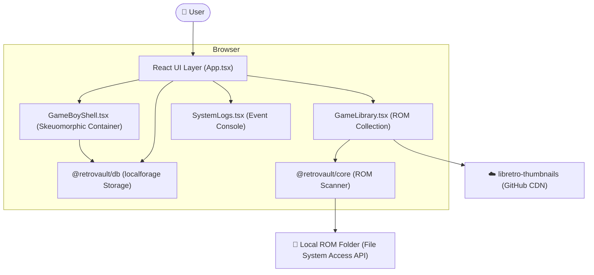
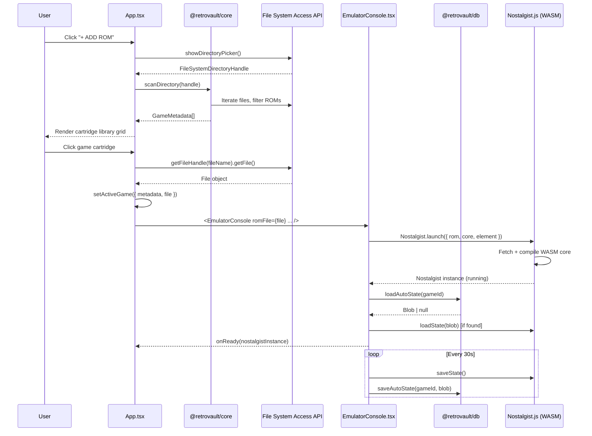

# System Architecture

## RetroVault — v1.1.0

**Status:** Implemented & Active

> This document describes the architecture **as actually built**, reflecting both the original design intent and the implementation decisions made during development.

---

## 1. High-Level Overview

RetroVault is a **local-first, single-page web application** that embeds full retro game emulation inside a highly detailed, skeuomorphic Game Boy console UI. It uses no backend server — all processing, storage, and emulation happens entirely inside the user's browser.



---

## 2. Architectural Layers

### 2.1 Presentation & Orchestration Layer — `apps/web/src/App.tsx`

The `App.tsx` file serves as the **Central Nervous System** of RetroVault. It is a large-scale React component that manages the following:

- **Global State Management**:
  - `games`: A reactive list of all indexed ROMs.
  - `activeGame`: The currently selected and loaded game state.
  - `emulatorInstance`: A reference to the running Nostalgist.js instance, allowing the UI to send commands (save, load, reset).
  - `systemLogs`: A rolling buffer of events and errors.
  - `userSettings`: Persisted preferences including volume, themes, and custom key bindings.
- **Layout Orchestration**: Uses a responsive flexbox/grid system to arrange the Library, the 3D-styled Game Boy shell, and the technical side panels.
- **Lifecycle Coordination**: It triggers the transition from "Library View" to "Gameplay Mode" by resolving file handles and passing them to the emulation components.
- **Input Management**: Capture and redirection of keyboard events to the emulator, including handling of "modal" states like key-rebinding.

### 2.2 Emulation Layer — `apps/web/src/components/GameBoy/GameBoyShell.tsx`

This component is the **Hardware Abstraction Layer**. It provides the skeuomorphic visual container and orchestrates the low-level `Nostalgist.js` engine:

- **Platform Resolution**: Automatically maps file extensions (GBA, SNES, NES, GB) to their high-performance WASM Libretro cores.
- **Engine Lifecycle**:
  - **Launch**: Manages the asynchronous compilation and initialization of WASM cores via Nostalgist.
  - **Memory Management**: Handles the bridge between browser Blobs and emulator memory for save states.
  - **Resolution Scaling**: Uses `ResizeObserver` to ensure the emulator canvas remains pixel-perfect regardless of the window size or orientation.
- **Background Processes**:
  - **Auto-Save Loop**: A non-blocking background task that snapshots game state every 30 seconds to the local database.
  - **Telemetry Sampling**: Extracts real-time performance metrics (FPS, Core usage) to pass back to the UI dashboards.
- **Error Recovery**: Implements a "Blue Screen of Death" (BSOD) system to catch WASM crashes and provide a safe "Eject" path for the user.

### 2.3 ROM Scanner Layer — `packages/core/src/files.ts`

Exposes three pure utility functions with no React or storage dependency:

#### `scanDirectory(dirHandle)`

Traverses the `FileSystemDirectoryHandle` provided by the browser's `showDirectoryPicker()` dialog. For each file matching `.gba`, `.smc`, `.sfc`, `.nes`, `.zip`, it:

1. Calls `extractMetadataFromName(fileName)` to get clean title and platform
2. Generates a stable `id` as `${fileName}-${file.size}`
3. Calls `getBoxArtUrl(title, platform)` to build the CDN box art URL
4. Pushes a `GameMetadata` object to the list

Returns all games sorted alphabetically by title.

#### `extractMetadataFromName(fileName)`

Uses RegExp to:

- Strip the file extension
- Remove leading numbering patterns (e.g., `1636 -`)
- Strip parenthetical region/group codes (e.g., `(U)(Squirrels)`, `(USA, Europe)`)
- Detect platform from extension

#### `getBoxArtUrl(title, platform)`

Constructs a direct URL to the official `libretro-thumbnails` GitHub repository, mapping platform codes to folder names and URL-encoding the title with underscores replacing spaces.

### 2.4 Storage Layer — `packages/db/src/index.ts`

Built on top of **localforage**, which uses IndexedDB under the hood with a clean key-value API. Four isolated store instances are created:

| Store Name | `localforage` Instance | Contents |
|---|---|---|
| `favorites` | `favoritesStore` | Array of favorited game IDs |
| `save_states` | `saveStateStore` | Save state blobs + metadata index |
| `settings` | `settingsStore` | `UserSettings` object |
| `play_history` | `playHistoryStore` | `PlayHistory` records per game |

Four typed service objects provide the public API:

**`SaveStateStorage`**

- `saveState(gameId, gameTitle, blob)` — writes binary blob + metadata entry
- `loadState(saveId)` — retrieves blob by exact save ID
- `getStatesForGame(gameId)` — retrieves all save metadata for a game
- `saveAutoState(gameId, blob)` — overwrites auto-save slot
- `loadAutoState(gameId)` — retrieves auto-save slot

**`SettingsStorage`**

- `getSettings()` — returns stored `UserSettings` or defaults
- `updateSettings(partial)` — merges changes and persists

**`PlayHistoryStorage`**

- `updatePlayHistory(gameId, increment)` — increments seconds and updates timestamp
- `getAllPlayHistory()` — returns full map for all games (used to show playtime badges on library cards)

**`FavoritesStorage`**

- `getFavorites()` / `toggleFavorite(gameId)` / `isFavorite(gameId)` — manages a stored ID list (UI is currently commented out, present for future use)

### 2.5 Shared UI Components — `packages/ui`

Provides base components (`Button`, `Card`) shared across the application. The `Card` component provides the consistent light-beige background, border shadows, and rounded corners used for the Library, Logs, Save States, and Config panels.

---

## 3. Data Flow: From Click to Game



---

## 4. Key Architectural Decisions

### Why Nostalgist.js instead of raw Web Workers?

Nostalgist.js encapsulates the entire Libretro WASM loading, threading, and canvas-binding complexity. It provides a clean async API for launching, saving, loading state, resizing, key press simulation, and exiting. This allowed us to focus engineering effort on UI fidelity rather than low-level WASM plumbing.

### Why `useRef` for volume/logging/keybindings in EmulatorConsole?

React's `useEffect` re-runs whenever its dependency array changes. If `onLog` (a new function reference on every render), `volume`, or `keyBindings` were in the deps array, any parent re-render (including telemetry FPS counter ticks) would tear down and restart the entire emulator. Instead, these values are written into mutable `useRef` containers that are always current but never trigger teardown.

- [Feature: Library Search & Filter](./Feature_Search_Filter.md)

### Why localforage instead of raw IndexedDB or OPFS?

The original architecture spec called for OPFS for ROM binary storage. In the delivered implementation, ROMs are accessed directly via the `FileSystemDirectoryHandle` (not copied into the browser). localforage provides a much simpler API for the metadata and save-state use cases without the need for service worker coordination or OPFS synchronous access handles in shared workers.

### Why the File System Access API instead of drag & drop uploads?

The FSA API gives persistent access to a user-selected directory, which means the app can re-read any ROM file on demand without the user uploading it. This allows a library of gigabytes of ROMs to be "indexed" with essentially zero storage overhead inside the browser.

---

## 5. Real Monorepo Structure

```
retrovault/
├── apps/
│   └── web/                        # Vite + React PWA
│       ├── src/
│       │   ├── App.tsx              # Root component (900+ lines)
│       │   ├── index.css            # Themes, scanlines, CRT, textures, sliders
│       │   └── components/
│       │       ├── GameBoy/
│       │       │   └── GameBoyShell.tsx
│       │       ├── Logs/
│       │       │   └── SystemLogs.tsx
│       │       └── Telemetry/
│       │           └── TelemetryDashboard.tsx
│       └── package.json
│
├── packages/
│   ├── core/
│   │   └── src/
│   │       ├── index.ts             # Re-exports
│   │       └── files.ts             # scanDirectory, extractMetadataFromName, getBoxArtUrl
│   ├── db/
│   │   └── src/
│   │       └── index.ts             # All localforage storage services
│   └── ui/
│       └── src/                     # Button, Card components
│
├── docs/                            # Full documentation suite
├── Games/                           # Local ROM directory (gitignored)
├── turbo.json
├── pnpm-workspace.yaml
└── package.json
```

---

## 6. CSS Architecture — Themes & Visual Effects

All global visual effects are defined in `apps/web/src/index.css` and applied conditionally via class names on the root `<div>`:

| Effect | Class | Description |
|---|---|---|
| CRT Filter | `crt-filter` | Rounded vignette shadow overlay simulating curved CRT glass |
| Scanlines | `scanlines` | Repeating linear gradient overlaid at 4px pitch (20% opacity) |
| Plastic Texture | `texture-plastic` | subtle noise pattern on the console shell surface |
| Custom Scrollbar | `custom-scrollbar` | Styled narrow scrollbars for panel overflows |

Color themes (`arcade-neon`, `gameboy-dmg`, `virtual-boy`) override CSS custom properties (`--retro-neon`, `--retro-neon-dim`) used throughout for accent colors on buttons, log text, and telemetry bars.
