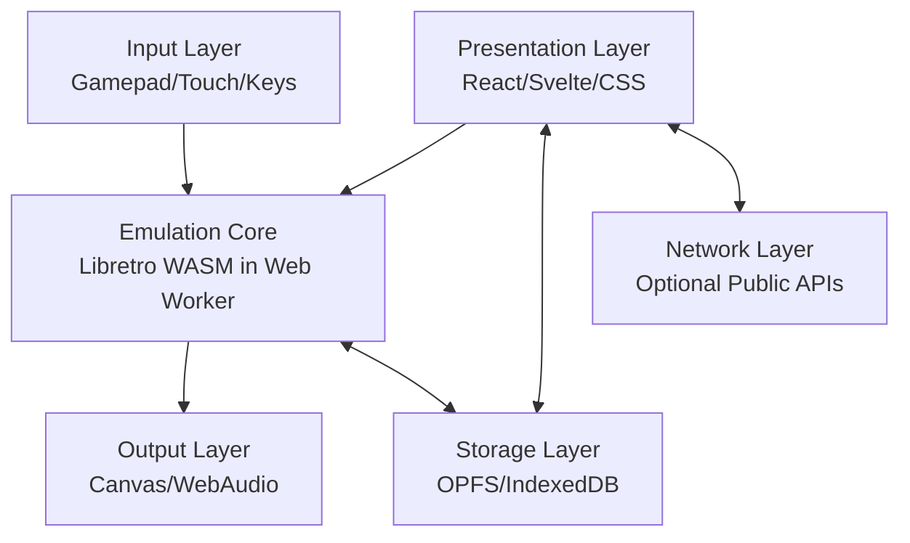
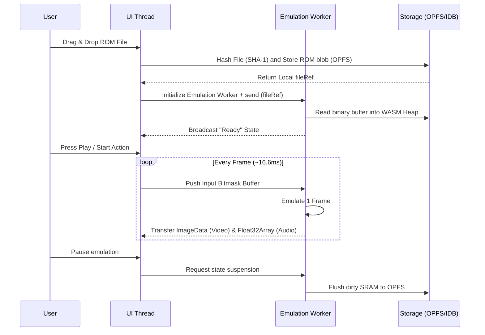

# System Architecture
## RetroVault

**Version:** 1.0.0
**Status:** Main Architecture Design

---

## 1. Architectural Overview
To ensure maximum graphical and processing performance (achieving strict 60 FPS output free of audio crackling or stutter) while retaining a highly interactive UI, RetroVault is built upon a **Decoupled Architecture**. It structurally separates heavy CPU emulation logic from standard UI thread events.



## 2. Architectural Layers

### 2.1 Presentation Layer (UI Thread)
* **Technologies**: TypeScript, React (or Svelte, for a diminished application bundle footprint), CSS Grid, Tailwind CSS.
* **Role**: Orchestrates rendering of the interactive, skeuomorphic "virtual shell". It dynamically manages DOM states, visual animations, context menus, and builds the visual Library Grid. It acts strictly as a "dumb" viewer driven by asynchronous system messages.

### 2.2 Input / Hardware Layer
* **Technologies**: HTML5 Web Gamepad API, JS Touch Events, DOM Keyboard Listeners, Web Haptics API (for rumble support).
* **Role**: Constantly polls and intercepts physical peripherals or virtual on-screen d-pads. Captures bitmasks of active inputs and streams them directly over a SharedArrayBuffer (or high-frequency `postMessage` loops) to the Emulation worker, targeting sub-10ms response latency.

### 2.3 Emulation Core (Web Worker)
* **Technologies**: Libretro WASM cores (e.g., `mGBA`, `Gambatte`) sandboxed entirely within isolated Web Workers.
* **Role**: Acts as the system powerhouse. Completely quarantining heavy emulation cycles unbinds it from freezing DOM rendering operations. It receives the controller buffers, executes millions of emulated CPU routines, and constructs raw audiovisual streams passed back to output buses.

### 2.4 Storage Layer
* **Technologies**: The Origin Private File System (`OPFS`) and IndexedDB (managed via `Dexie.js`).
* **Role**: Crucial for high-speed file storage operations exceeding classical standard limits. OPFS acts as the lightning-fast virtual hard drive handling bulk binary data (large `.gba` multi-megabyte chunks and sprawling save states). IndexedDB serves purely as an agile relational index supporting high-performance searching across thousands of stored instances.

### 2.5 Output Layer
* **Technologies**: HTML5 `<canvas>` (configured via WebGL / WebGPU contexts), CSS `image-rendering: pixelated;`, Web Audio API worklets.
* **Role**: Translates raw data into visible or audible assets. Enforces strict pixel-perfect, aliased rendering matrices minimizing visual blur while efficiently synchronizing 32kHz (or 44.1kHz) audio data pools to ensure crackle-free audio.

## 3. Emulation Flow & Lifecycle



## 4. Open-Source Monorepo Structure
To ensure project modularity and seamless future maintenance, a Turborepo-driven monorepo pattern layout is defined.

```text
retrovault/
├── apps/
│   └── web/                   # Main PWA application utilizing packages
├── packages/
│   ├── core/                  # Web Worker/WASM bridge orchestration logic
│   ├── ui/                    # Sharable React/Svelte presentational components
│   ├── config/                # Shared ESLint/TS configs
│   └── db/                    # Shared Dexie Database models + Schemas
└── package.json
```

## 5. Plugin & Modularity System
Aiming for future-proofing, the `packages/core` logic exposes deeply typed TypeScript interfaces (`IEmulationCore`). Members of the developer community can thus transparently write localized wrappers bridging, for instance, SNES (`Snes9x`), Nintendo 64 (`Mupen64`), or PS1 (`Beetle`) bindings without needing massive overhauls regarding how the primary `apps/web` application executes visual flow. 
