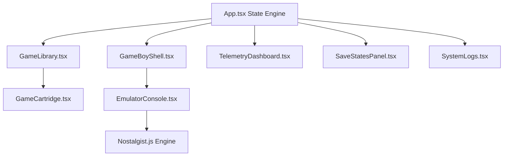

# UI Design & Wireframes — RetroVault v1.1.0

## 1. Dimensional Architecture
RetroVault is engineered with a **responsive skeuomorphic ratio**. The central console is based on the physical dimensions of the 1989 Game Boy (approx. 90mm x 148mm), scaled perfectly in the browser.

### 1.1. The Three-Column Workspace (Desktop)
- **Vault Sidebar (Left)**: `min-w-[320px] max-w-[400px]`. Contains the cartridge grid and filtering logic.
- **Console Core (Center)**: `flex-1`. A dynamic viewport that auto-scales the `490px x 860px` shell.
- **Diagnostic Panels (Right)**: `w-[380px]`. A vertical stack of telemetry and system logs.

## 2. Component Hierarchy & Data Flow
The UI architecture is built using a **Strict Orchestration** pattern where `App.tsx` handles state while children remain high-performance presentation layers.

## 3. Aesthetic Language: "Retro Technical"
The design system uses **Material Tokens** rather than just color HEX codes to maintain consistency.

### 3.1. Construction Materials
- **DMG-Chassis**: `#e0ddcf` plastic with noise-grain texture (`texture-plastic`).
- **Internal-Recess**: `#b5b3a6` (used for the battery compartment and button wells).
- **Material-Hard-Shadow**: `8px block shadow` with `#9a9789`.
- **Maroon-Plastic**: `#d61e6d` (the signature A/B button material).

### 3.2. LCD Composition
The virtual screen is a composite of 5 distinct layers:
1.  **Engine Layer**: The raw WASM canvas at original resolution.
2.  **Pixel-Grid Layer**: A `3px x 3px` transparent overlay simulating the LCD structure.
3.  **Vignette Layer**: Darkened corners simulating a cathode-ray or vintage LCD tube.
4.  **Reflection Layer**: A 45-degree white gradient simulating top-down light.
5.  **Bezel Frame**: The distinctive grey screen bezel with secondary hardware logos.

## 4. Interaction & State Transitions

| Component | State: IDLE | State: SCANNING | State: ACTIVE |
| :--- | :--- | :--- | :--- |
| **D-Pad** | Static Shadow | Static Shadow | **`active:translate-y-[2px]` (Tactile Feedback)** |
| **LCD** | "插入卡带" Text | Spinning Loader | **60 FPS Video Feed** |
| **SysLogs** | "READY..." | "SCANNING..." | **Bootstrap Logs** |
| **Power LED** | Dim Red | Pulsing Green | **Solid High-Intensity Green** |

## 5. Mobile Portability Flow
On small screens, the three-column layout collapses into a **Skeuomorphic Fullscreen** view:
- **Navigation**: Managed via a bottom bottom-sheet (`MobileBottomSheet.tsx`).
- **Library**: Overlays the console as a sliding pane.
- **Controls**: Touch-mapped zones are scaled for thumb ergonomics on physical touchscreens.
